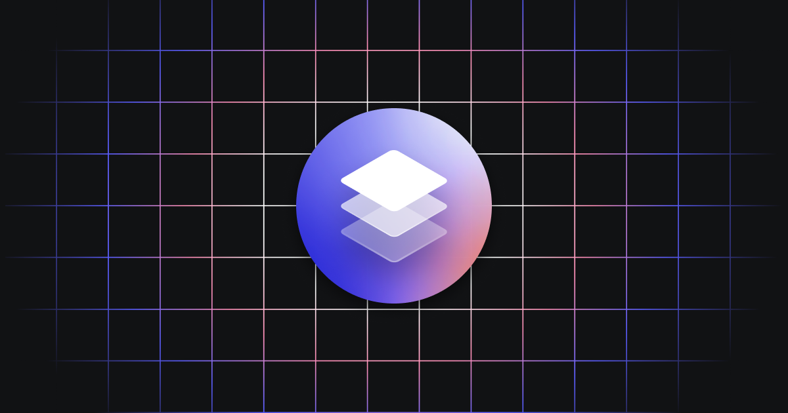

_Disclaimer: ℹ️ OpenFin Container is a commercial product and this repo is for evaluation purposes. Use of the OpenFin Container and OpenFin Container components is only granted pursuant to a license from OpenFin (see manifest). Please contact us if you would like to request a developer evaluation key or to discuss a production license._

# OpenFin Container

OpenFin Container is a desktop runtime application environment that enables communication between all of your apps (web, legacy, third-party) for the enterprise desktop. It is built on top of Google Chromium and GitHub Electron and combines advanced interoperability, lightning-fast distribution, and robust security with an agile web development and deployment model.

- [Learn more about the OpenFin Container](https://developers.openfin.co/of-docs/docs/container-overview)

## What can you do with this repository

This repository contains examples for common use cases and API implementations. Each how-to example represents a specific use case and contains implemented API details, required manifest attributes, and any external dependencies necessary to run the how-to example.

## Examples

| **Example**                                                          | **Description**                                                                                    |
| -------------------------------------------------------------------- | -------------------------------------------------------------------------------------------------- |
| [create-window](./how-to/create-window)                              | This example shows how to create a dynamic window or from a manifest.                              |
| [use-security-realms](./how-to/use-security-realms)                  | This example shows you security realms work with multiple target environments                      |
| [use-preloads](./how-to/use-preloads)                                | This example shows you a number of examples on how preload scripts can be used in your application |
| [use-channel-api](./how-to/use-channel-api)                          | This example shows you a number of examples on how to use the channel api for messaging            |
| [use-dynamic-manifest](./how-to/use-dynamic-manifest)                | This example contains examples of generating a manifest file dynamically                           |
| [integration-excel](./how-to/integration-excel)                      | This example demonstrates how to integration with Excel using the OpenFin adaptor                  |
| [use-popup-window](./how-to/use-popup-window/)                       | This example contains various examples of how to use popup windows                                 |
| [use-window-options](./how-to/use-window-options/)                   | This example demonstrates the options available for opening windows                                |
| [use-interop](./how-to/use-interop/)                                 | This example contains various implementations and use cases for the Interop API                    |
| [use-a-manifest](./how-to/use-a-manifest/)                           | This example contains various examples of how to use the OpenFin manifest                          |
| [use-content-creation-rules](./how-to/use-content-creation-rules/)   | This example demonstrates how content creation rules can be applied                                |
| [use-logging-apis](./how-to/use-logging-apis/)                       | This example shows how to use OpenFin APIs to retrieve logs and send them to a server.             |
| [use-launch-external-process](./how-to/use-launch-external-process/) | This example demonstrates how to use the launch external process secure api.                       |
| [use-platform](./how-to/use-platform/)                               | This example contains various examples of how to use Platform                                      |

## Before you get started

Read more about our [recommended development environment](https://developers.openfin.co/of-docs/docs/set-up-your-dev-environment).
