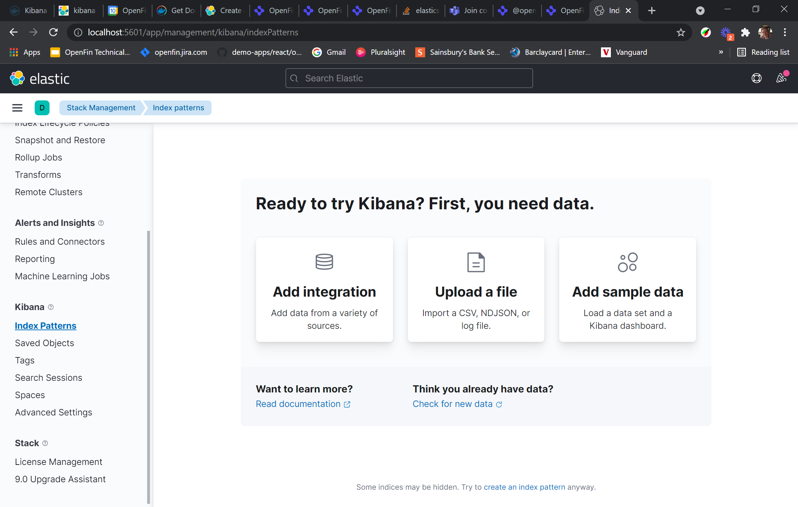
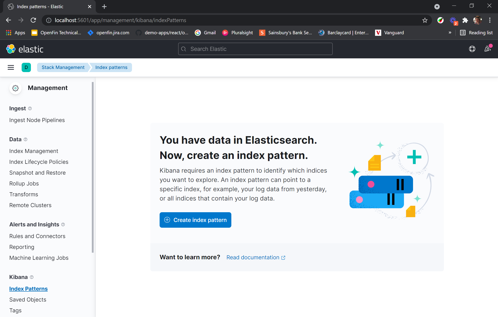
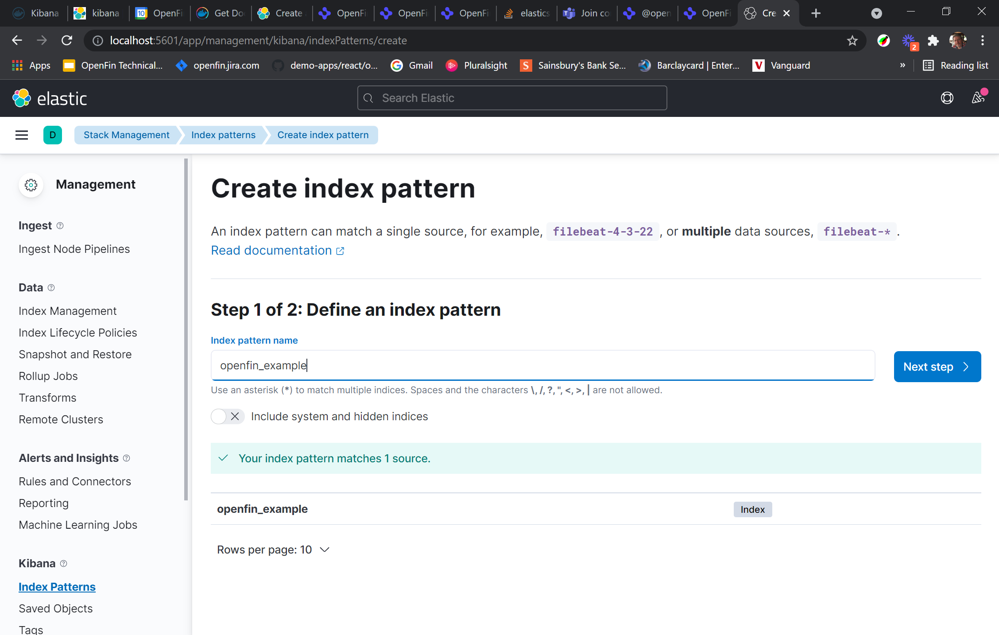
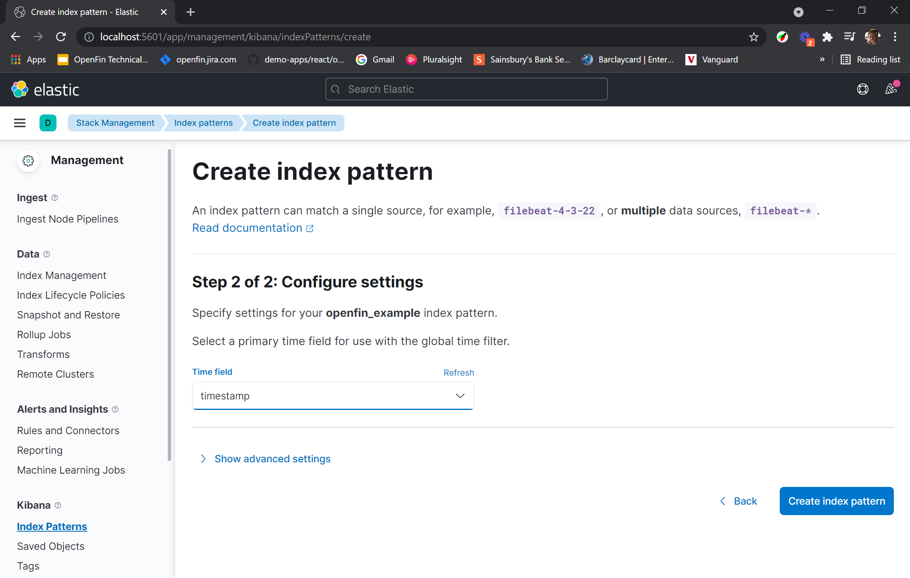
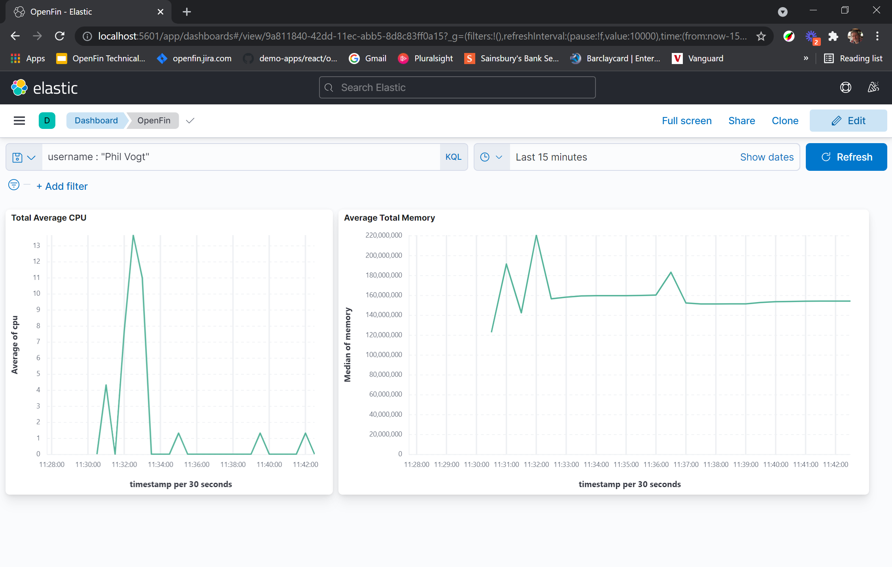

# Installing Kibana and ElasticSearch

Please not that you can find a host of different ways to install Elastic Search and Kibana [here](https://www.elastic.co/guide/en/elasticsearch/reference/current/install-elasticsearch.html). We're using Docker as an example below, but please install ElasticSearch and Kibana in whichever way makes most sense for you.

## Installing via Docker

1. Install Docker, follow the instructions here https://docs.docker.com/get-docker/ for your operating system.
2. Install elasticsearch image as per instructions below.

    a. See https://hub.docker.com/_/elasticsearch or follow the next basic steps...

    b. From a command line or from docker desktop UI. Run in the following command to dowload elasticsearch, change the version tag to suit your needs. 
		
        
        docker pull docker.elastic.co/kibana/kibana:8.0.0-alpha1 
		
    d. Create a docker network to be shared between elasticsearch and kibana with the following command.
		
        docker network create openfin-network 
		
    f. Then run the image up from Docker Desktop application. Ensure to set the network you created earlier, or  run the following command line, changing where appropriate. Note; the cors allow origin from the local app to be able to post to the elastic search rest endpoint.
		
        docker run -d --name elasticsearch --net openfin-network -p 9200:9200 -p 9300:9300 -e "discovery.type=single-node" -e "http.cors.allow-origin=/https?:\/\/localhost(:[0-9]+)?/" -e "http.cors.enabled=true" docker.elastic.co/elasticsearch/elasticsearch:8.0.0-alpha1

3. Now install kibana image as per the instructions here

	a. See https://hub.docker.com/_/kibana or follow the next basic steps...
	
    b. From command line or from docker desktop UI. Run in the following command to download kibana, change the version tag to suit your needs.
	
        docker pull docker.elastic.co/kibana/kibana:8.0.0-alpha1 
	
    d. Then run the image up from Docker desktop, ensure to set the network you created earlier, or  run the following command line, changing where appropriate…
	
        docker run -d --name kibana --net openfin-network -p 5601:5601 docker.elastic.co/kibana/kibana:8.0.0-alpha1

4. Navigate to http://localhost:5601/app/kibana_overview#/ and ensure that kibana is running and served up correctly.

5. Next we need to create a simple index pattern for ElasticSearch, see [here](https://www.elastic.co/guide/en/kibana/current/index-patterns.html) for details. For this example, create an index that matches with the "post endpoint" in the kibana-poster.js file, i.e. "openfin_example". See below.

	    export function send(data) {
	        xhttp.open("POST", "http://localhost:9200/openfin_example/_doc", true);
	        xhttp.setRequestHeader("content-type", "application/json");
	        xhttp.send(JSON.stringify(data));
	    }

6. If you see this screen, then it means that no data has been ingested, to fix that, run the example openfin app, as described in the [OpenFin Test Application readme](openfin.md).

    		

7. Once that's done, either click "check for new data" or if the screen updates automatically, select "Create Index Pattern".

    

8. Type "openfin_example", then press "Next Step". This will match the index data being passed in from our rest calls. 

    

9. ElasticSearch will automatically define mappings for all the data you've ingested. Make sure to select "timestamp" as your selected Time Field, then click "Create Index Pattern" to finish.

    

10. Finally go ahead and create a simple dashboard, here's an example which is looking at "total average CPU" and "total Average Memory" for our test app (see details in the [OpenFin Test Application readme](openfin.md)).

    