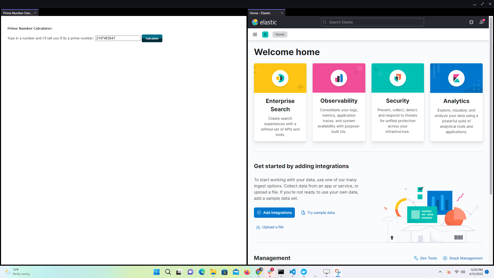
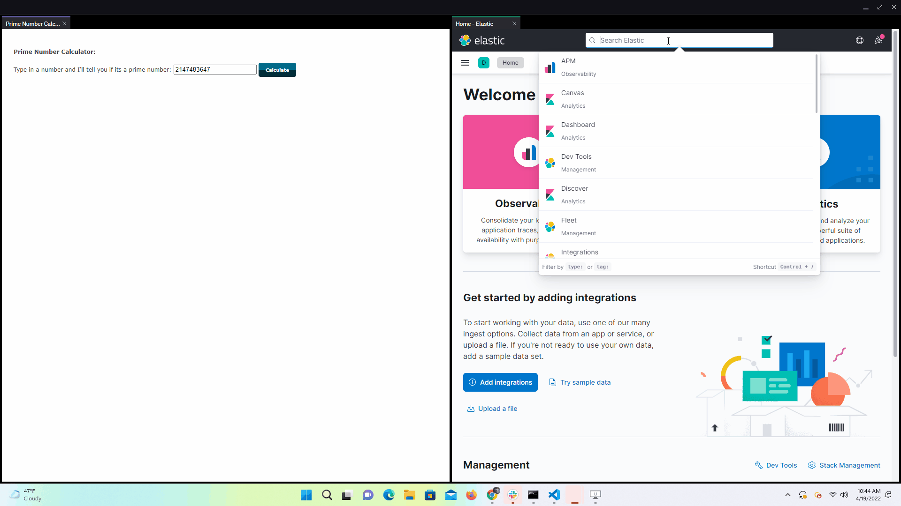
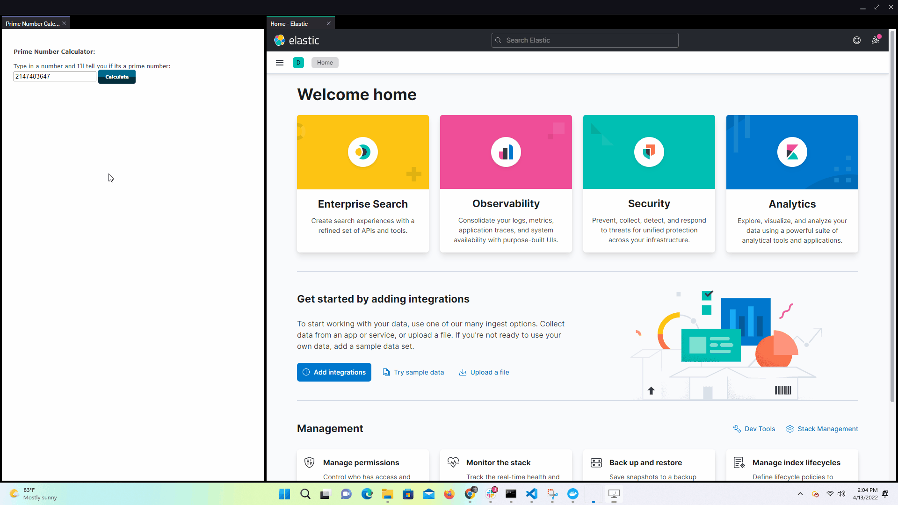

# Add Analytics to your Application

This application you are about to build and run, is a simple example of leveraging OpenFin's [System API](https://developer.openfin.co/docs/javascript/stable/System.html), along with ElasticSearch and Kibana, to show you how you can setup your own live metrics for your OpenFin enhanced applications. This is not a best practices guide, merely to show what's possible. 

This example assumes you have already [set up your development environment](https://developers.openfin.co/of-docs/docs/set-up-your-dev-environment).

## Getting Started

### Docker Configuration

> Please note that you can find a host of different ways to install Elastic Search and Kibana [here](https://www.elastic.co/guide/en/elasticsearch/reference/current/install-elasticsearch.html). We're using Docker as an example below, but please install ElasticSearch and Kibana in whichever way makes most sense for you.

#### Using Docker Compose CLI

If you have [docker-compose](https://docs.docker.com/compose/reference/), you can use the example `docker-compose.yml` configuration provided. 

If you do not have docker-compose please refer to the guide [here](Docker.md) to install the necessary dependencies and configure the docker container for this example.

```bash
> docker-compose up
```


After the docker container is built and ready, navigate to http://localhost:5601/app/kibana_overview#/ in a browser and ensure that kibana is running and served up correctly before moving on to the next steps. 

### Building the OpenFin Application

After Kibana is successfully up and running, we can move on to building the OpenFin application.

1. Install dependencies.

```bash
> npm install
```

2. Build the project.

```bash
> npm run build
```

3. Start the test server in a new window.

```bash
> start npm run start
```

4. Start the client application
```bash
> npm run client
````

After starting the client application you should an application as seen below.



> Note: For step 5 if you are using Elastic Search & Kibana versions < 8.1.2 replace Data View(s) with Index Pattern(s)

5. Next we need to create a simple Data View for ElasticSearch, see [here](https://www.elastic.co/guide/en/kibana/current/index-patterns.html) for details. For this example, create an index that matches with the "post endpoint" as defined in `client/src/kibana-poster.ts`. 
   1. In the search elastic input type "Data Views" and navigate to "Kibana/Data Views". 
   2. Click on the "Create data view button"
   3. Type in "openfin_example" to match the available index source.
   4. Select "timestamp" as the "Timestamp field" value.



6. After creating the index pattern we can simulate a CPU spike and create a visualization for the specific platform view where the spike is coming from.
   1. In the Prime Calculator App click on the "calculate" button.
   2. Navigate to the "Dashboard" link under the analytics section in the elastic app menu.
   3. Select "create new dashboard".
   4. Select "create visualization".
   5. Drag the "cpu" field, which has been derived from the payload created in the `client/src/monitor.ts` file, into "vertical axis" section. 
   6. Drag the "timestamp" into the "horizontal axis" section.



7. From here, the tools used for data ingestion / processing can be used to generate dashboards. One example may be to produce comparative metrics or monitor anomalies in, or close to realtime. See below for a complete look at what can be done using this example!


### A note about this example

This is an example of how to use OpenFin APIs to configure OpenFin Container. Its purpose is to provide an example and suggestions. DO NOT assume that it contains production-ready code. Please use this as a guide and provide feedback. Thanks!