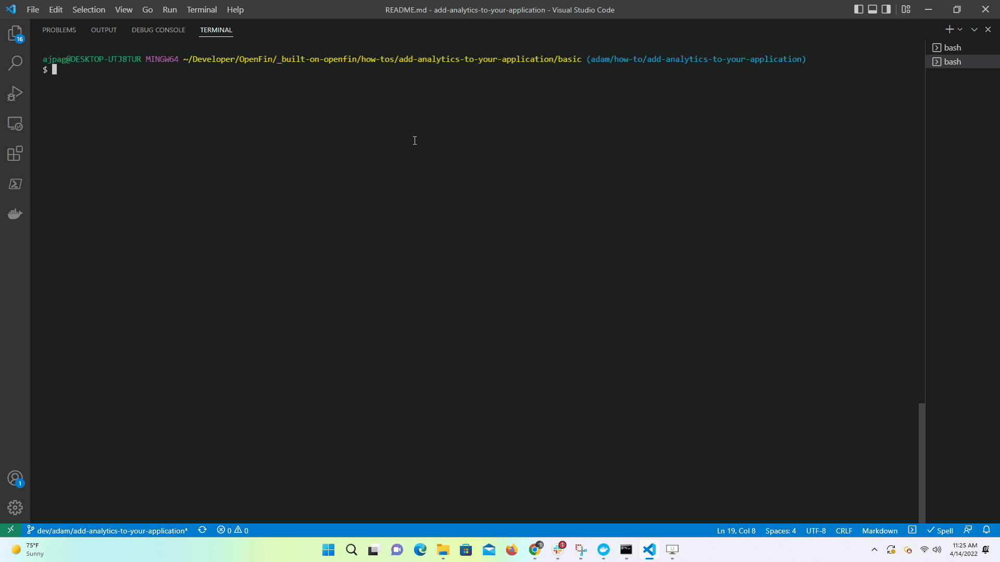

# OpenFin example application to show cpu and memory usage payloads

## Getting Started

1. Install dependencies.

```bash
$ npm install
```

2. Build the project.

```bash
$ npm run build
```

3. Start the test server in a new window.

```bash
$ start npm run start
```
4. Start the application.
   
```bash
$ npm run client
```



### A note about this example

This example intends to show how metrics can be retrieved from an OpenFin entity using the System API and monitoring a window. In this case, for simplicity we are monitoring the platform provider window, which is commonly used to debug a platform application. The provider window could be used to retrieve metrics for an existing window or view, and persist or show them at a different location. 

This is an example of how to use OpenFin APIs to configure OpenFin Container. Its purpose is to provide an example and suggestions. DO NOT assume that it contains production-ready code. Please use this as a guide and provide feedback. Thanks! 


 


