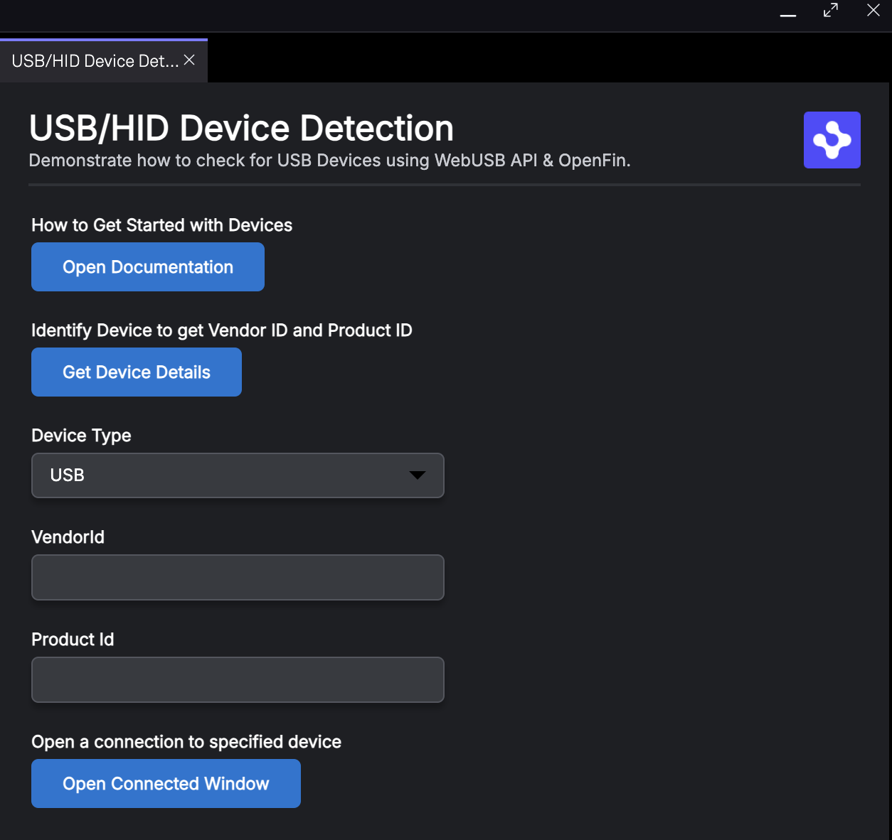
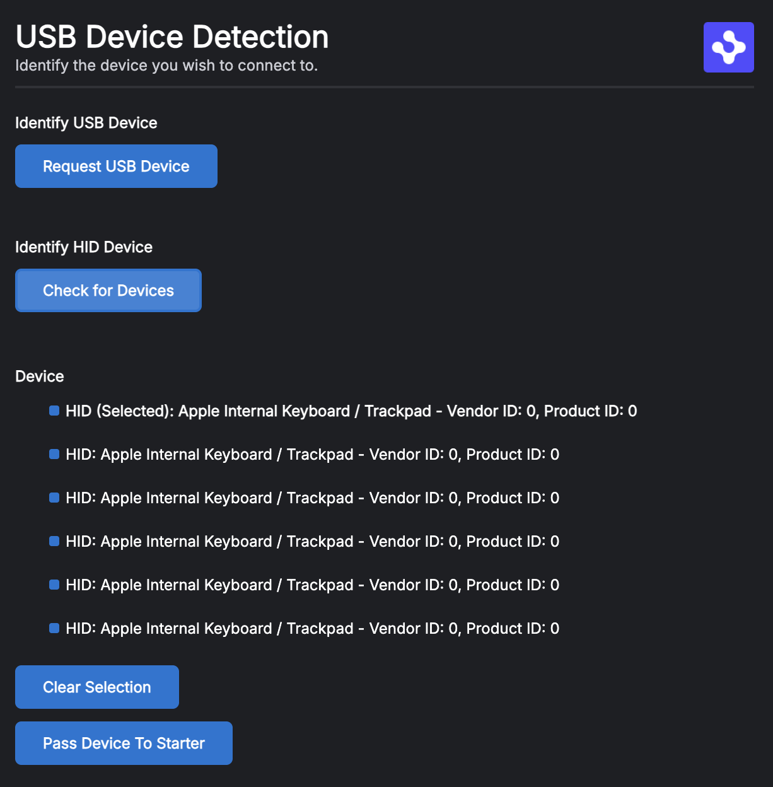

# Detect USB Devices

## How it Works

Using a combination of the manifest file and WebUSB/WebHID APIs, we permission and get connected USB devices inside of a container application.

## Get Started

Follow the instructions below to get up and running.

### Set up the project

1. Install dependencies and do the initial build. Note that these examples assume you are in the sub-directory for the example.

```shell
npm run setup
```

2. Build the project.

```shell
npm run build
```

3. Start the test server in a new window.

```shell
npm run start
```

4. Start the Platform application.

```shell
npm run client
```

### What you will see

#### Main App View (app.html)

- A view loaded into a platform window.
- It contains a button to open up the HERE related documentation in a new window.
- It contains a button to open up a window in your default browser (Chrome/Edge) called device-identifier.html
- Form elements to say whether you are targeting a USB or HID Device, the VendorID and the ProductID of the device you are looking to test against (these details can be return by the device-identifier.html page).
- It contains a button that will take the data from the form elements to create a new window with the correct permissions to allow a connection to the specified device (device-connector.html).



#### Device Identifier (device-identifier.html)

Launched from the main window into your default desktop browser (e.g. Chrome/Edge). This page provides two buttons so you can pick a USB or HID device. On selection the results will be presented so that you can manually add the VendorID and ProductID on the main page or you can use a button to return to the pass the details back to the form elements within the platform.



#### Device Connector (device-connector.html)

Launched from the main window using the form details related to the target device. The permissions of the launched window will include the correct details for the connection and the window will show a code section showing some example code and a log section that shows what's happening. There is an option to open a connection to the device through a button.


## Example Loom

<https://www.loom.com/share/63d31b30454e478fbc415724fb28ec82?sid=1480153e-c2a3-4208-98b9-1b2c45df554b>

## Required Permissions

Permissions need to be defined in the window/view that wants to connect to a USB/HID device. This lets developers connect to the device without requiring user interaction.

This can be done in a number of places and must include the webAPIs permissions to access usb and hid devices as well as the list of devices you are allowing by providing their vendor and product Ids:

### Manifest - startup_app

If you have a classic manifest where you are using a startup_app definition and you want the entry (main) window to be able to connect to a device then you can have the following defined:

```json
{
  "startup_app": {
    "permissions": {
      "webAPIs": ["hid", "usb"],
      "devices": [
        {
          "vendorId": 3034,
          "productId": 21783
        }
      ]
    }
  }
}
```

### Manifest - platform

If you have a platform app with a custom platform provider window and you want the platform provider to connect then you will need to define the rules inside of the platform section of your manifest. \*\*Please note if any child window/view needs access to usb/hid devices then the platform should define the permission (it doesn't need to specify the devices but the permission should be available at the root level).

```json
{
  "platform": {
    "permissions": {
      "webAPIs": ["hid", "usb"],
      "devices": [
        {
          "vendorId": 3034,
          "productId": 21783
        }
      ]
    }
  }
}
```

#### Window Level

You can either set the window permissions for all windows through Default Window Options (if you are using a platform manifest setup) or for a specific window through Window Options when you launch it.

##### Default Window Options

```json
{
  "platform": {
    "permissions": {
      "webAPIs": ["hid", "usb"]
    },
    "defaultWindowOptions": {
      "permissions": {
        "webAPIs": ["hid", "usb"],
        "devices": [
          {
            "vendorId": 3034,
            "productId": 21783
          }
        ]
      }
    }
  }
}
```

##### Window Options

If you only want a specific window to have this permission then you can specify the permission as part of the window options when launching it (this is the approach used by the sample when it is launching a window targeting a specific device).

```json
{
  "url": "The url to load alongside other settings",
  "permissions": {
    "webAPIs": ["hid", "usb"],
    "devices": [
      {
        "vendorId": 3034,
        "productId": 21783
      }
    ]
  }
}
```

#### View Level

If you are using a platform manifest and views then you can either set the view permissions for all views through Default View Options or for a specific view through View Options when you launch it.

##### Default View Options

```json
{
  "platform": {
    "permissions": {
      "webAPIs": ["hid", "usb"]
    },
    "defaultViewOptions": {
      "permissions": {
        "webAPIs": ["hid", "usb"],
        "devices": [
          {
            "vendorId": 3034,
            "productId": 21783
          }
        ]
      }
    }
  }
}
```

##### View Options

```json
{
  "permissions": {
    "webAPIs": ["hid", "usb"],
    "devices": [
      {
        "vendorId": 3034,
        "productId": 21783
      }
    ]
  }
}
```

##### Domain Settings

If your platform is loading or navigating to a number of different domains and you only want your specific domain to be able to connect to the device then we would recommend using Domain Settings. If you are already familiar with domain settings we generally recommend them over window/view level settings as they ensure only your domain can utilize a permission.

<https://resources.here.io/docs/javascript/stable/interfaces/OpenFin.DomainSettings.html>

## Code Example

You do not need to request the device as the permissions have already given access.

You can get the devices and then open the one you wish using standard JavaScript APIs. The example below is using the HID API but the sample will provide code snippets for USB or HID when run.

```js
// Listen for device connection and disconnection events
navigator.hid.addEventListener('disconnect', (event) => {
  console.log('HID disconnected: ' + event.device.productName);
});
navigator.hid.addEventListener('connect', (event) => {
  console.log('HID connected: ' + event.device.productName);
});

// Getting HID devices
// You don't need to call requestDevice as the device has already been given permissions through the manifest/window/view permission settings. You can call getDevices to interact with the device.
const devices = await navigator.hid.getDevices();
console.log('Found ' + devices.length + ' HID devices.');
devices.forEach((device, index) => {
  console.log(
    'Device ' +
      (index + 1) +
      ': Product Name: ' +
      device.productName +
      ', Vendor ID: ' +
      device.vendorId +
      ', Product ID: ' +
      device.productId
  );
});

// Selecting the first device (if any)
const device = devices.length > 0 ? devices[0] : null;

// Opening the device
if (device) {
  await device.open();
  console.log('Device opened:', device.productName);
  // Add event listeners for input reports
  device.addEventListener('inputreport', (event) => {
    // perform custom logic here. The below is just an example.
    const data = new Uint8Array(event.data.buffer);
    console.log('Input report received:', data);
  });
} else {
  console.log('No device selected');
}
```
