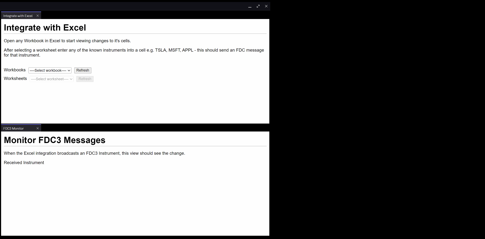
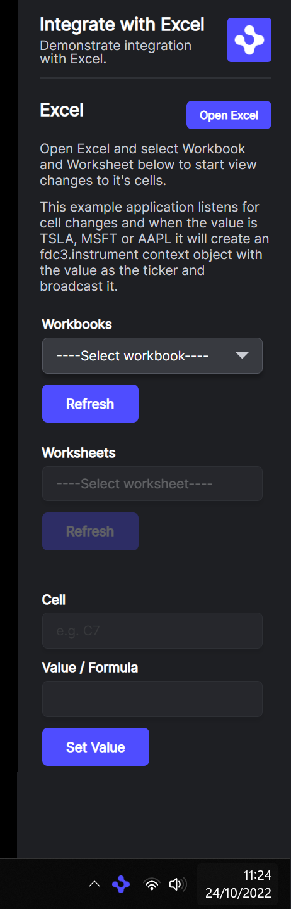

# Integrate with Microsoft Excel

This repository demonstrates how to use OpenFin’s Excel integration in order to interact with the Microsoft Excel native client application. The Excel integration API is an ES module provided via the [@openfin/excel](https://www.npmjs.com/package/@openfin/excel) NPM package.

For further information about the Excel integration, refer to the developer [documentation](https://developers.openfin.co/of-docs/docs/excel-integration).

## How it Works

The excel.ts looks for a running version of Excel and will let you select an active workbook and worksheet. Then the application will monitor changes to the cells in Excel and display all of them. If at any point the application sees one of the known instruments it will broadcast it as an FDC3 instrument.

The secondary fdc3monitor.ts will monitor for the FDC3 instrument messages.

## Get Started

Follow the instructions below to get up and running.

### Set up the project

1. Install dependencies. Note that these examples assume you are in the sub-directory for the example.

```shell
npm install
```

2. Build the project.

```shell
npm run build
```

3. Start the test server in a new window.

```shell
npm run start
```

4. Start the Platform application.

```shell
npm run client
```

### What you will see

A window that contains two views, the Excel integration and the FDC monitor.



### View in panel

An additional version of the view which is shown in a panel on the right of your screen, and is launched from a tray icon.

```shell
npm run secondclient
```



### A note about this example

This is an example of how to use OpenFin APIs to configure OpenFin Container. Its purpose is to provide an example and suggestions. **DO NOT** assume that it contains production-ready code. Please use this as a guide and provide feedback. Thanks!
