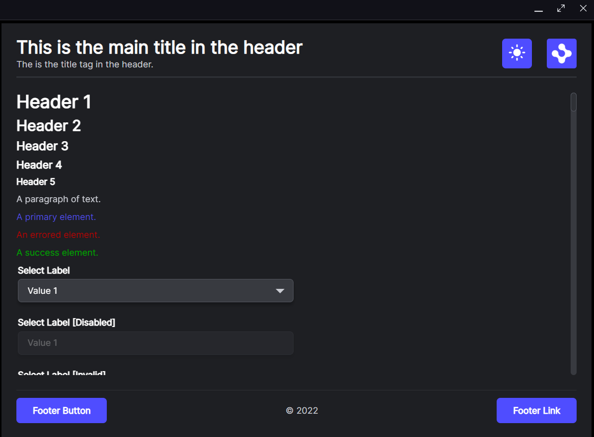

# Demonstrate launching a site as a single page platform

## How it Works

The manifest file [public/manifest.fin.json](public/manifest.fin.json) has a snapshot definition. We define a single url (our starter style guide as an example) and that the view should not show a tab (so you only see the main frame). The platform does not have a custom window template (it is using the default OpenFin template with minimize, maximize and close) and it doesn't specify a custom provider url (so it does not have an initial background page running background logic). This is a simple platform definition which can act as a first step with the potential of using platform capabilities in the future.

## Get Started

Follow the instructions below to get up and running.

### Set up the project

1. Install dependencies and do the initial build. Note that these examples assume you are in the sub-directory for the example.

```shell
npm run setup
```

2. Build the project.

```shell
npm run build
```

3. Start the test server in a new window.

```shell
npm run start
```

4. Start the Platform application.

```shell
npm run client
```

### What you will see

1. A single platform window show the starter style guide in a view with no tab.



## If you wish to remove the padding from around the view

In [manifest.fin.json](./public/manifest.fin.json) we include a path to a css file that should be injected into the default platform window (within default window options) [window-override.css](./public/window-override.css). The css is commented out but includes instructions on how you can show the padding around the single view and how you can remove that padding using css.

## Is there any other way of launching a single window under a platform?

Yes you could include a single classic window in the snapshot within the manifest instead of a window with a layout.

You can see an example of this here: [second.manifest.fin.json](./public/second.manifest.fin.json).

You can run this platform using the following command:

```shell
npm run secondclient
```

### A note about this example

This is an example of how to use OpenFin manifests to configure OpenFin Container. Its purpose is to provide an example and suggestions. **DO NOT** assume that it contains production-ready code. Please use this as a guide and provide feedback. Thanks!
