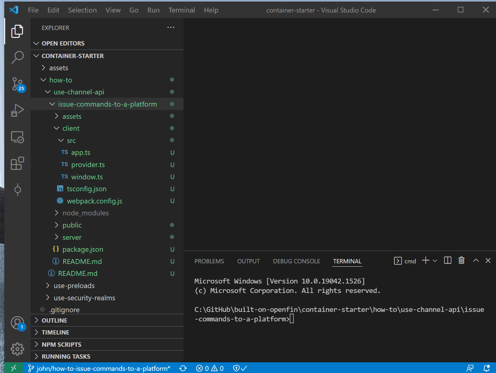
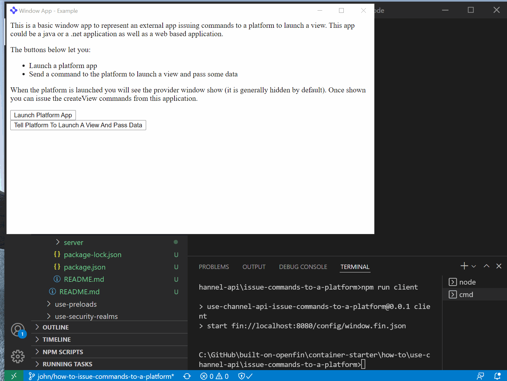

# Use Channel API - Issue Commands To A Platform

This repository demonstrates how to use the Channel API to support launching content into a platform application from an external application.

The application issuing the command is a traditional OpenFin window application but could just as easily have been a Java or .NET application.

The main logic for the creation of the command channel can be found in [client/src/provider.ts](client/src/provider.ts).

## How it Works

The OpenFin window application launches and exposes three buttons.

- One button launches the target platform that complements the OpenFin window app and connects to the channel
- The second button triggers logic that issues the createView command passing in fresh custom data and some view options
- The third button issues the createView command but additionally passes in a target which is the last launched window/view

The view that gets launched into the platform checks the customData that was passed to it and writes it out to the html document (for demonstration purposes). This could be an application view reading in passed context and using it to either fetch additional information or display it on the screen.

## Get Started

Follow the instructions below to get up and running.

### Set up the project

1. Install dependencies. Note that these examples assume you are in the sub-directory for the example.

```shell
npm install
```

2. Build the project.

```shell
npm run build
```

3. Start the test server in a new window.

```shell
npm run start
```

4. Start the OpenFin Window application.

```shell
npm run client
```



### What you will see

1. The OpenFin Window application launches

2. A button on the OpenFin Window Application launch the platform and connect to the channel

3. A second button on the OpenFin Window Application issues a createView command.

4. A third button on the OpenFin Window Application issues a createView command and passes information related to the last launched view (which window it was attached to).



### A note about this example

This is an example of how to use OpenFin APIs to configure OpenFin Container. Its purpose is to provide an example and suggestions. **DO NOT** assume that it contains production-ready code. Please use this as a guide and provide feedback. Thanks!
