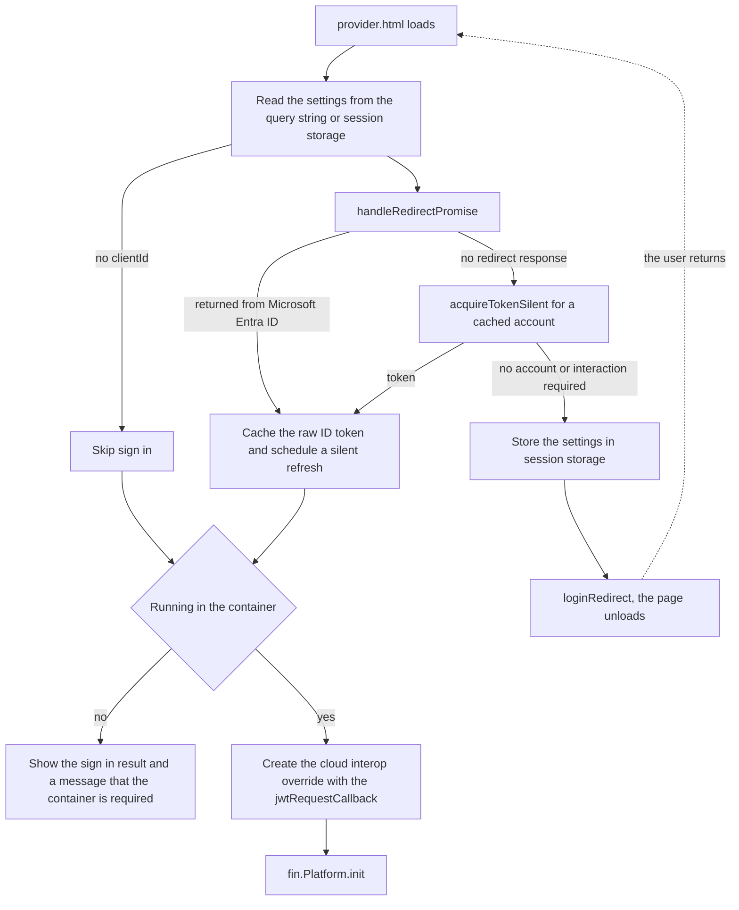
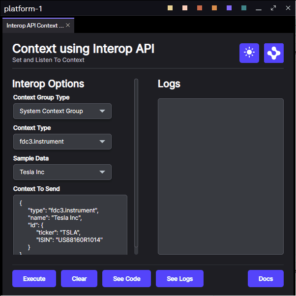
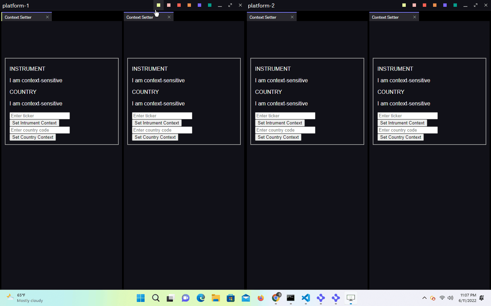

# Use Cloud Interop with Microsoft Entra ID

This repository demonstrates how to authenticate against HERE's [cloud interop](https://www.npmjs.com/package/@openfin/cloud-interop) offering using a Microsoft Entra ID token, so that context can be shared between two different Platform Applications.

It is the [Use Cloud Interop](../cloud-interop) example with `basic` authentication replaced by `jwt` authentication, where the JWT is an ID token acquired from Microsoft Entra ID using [@azure/msal-browser](https://www.npmjs.com/package/@azure/msal-browser).

Before diving in we recommend taking some time familiarize yourself with the concepts and terms found in the [interoperability overview](https://resources.here.io/docs/core/container/interop/) section of our documentation.

> **_:warning: This is an example, not a production auth design:_** validate it against your own app registration, Conditional Access policies, redirect URIs and a security review before using anything like it in production. HERE never signs the JWT, it only verifies what your callback returns.

## How it Works

The platform provider signs the user in **before any HERE code runs**. Only once a token has been cached does the provider read its manifest, create the cloud interop override and call `fin.Platform.init`. The logic for this is in [client/src/provider.ts](./client/src/provider.ts) and [client/src/entra.ts](./client/src/entra.ts).

Sign in uses a **redirect** rather than a popup, so the provider page loads twice: once to start the sign in and once when Microsoft Entra ID redirects back. The platform is only initialized on the second load. Because the redirect happens in the provider window itself, both manifests set `platform.autoShow` to `true` so that the window is visible and the experience is the same as opening the page in a browser.



`jwtRequestCallback` cannot be asynchronous, so `signInToEntra` acquires the token up front, keeps it in memory, refreshes it in the background at 80% of its lifetime and returns a synchronous callback that hands back the cached **raw ID token string**. Returning anything other than a compact JWT (`header.payload.signature`) fails with `JWSInvalid: Invalid Compact JWS`.

The background refresh is silent only. Once the platform is running, redirecting the provider window to sign in again would navigate it away from the platform it is hosting, so a failed refresh is logged and the previous token is kept.

### Redirect or popup

The redirect is a choice made for this example, not a requirement of cloud interop. MSAL supports both interaction types and either can produce the token that `jwtRequestCallback` hands over, so your platform is free to use `loginPopup` and `acquireTokenPopup` instead. What cloud interop cares about is only that the callback returns a valid raw JWT.

The redirect was chosen here because it keeps the demo simple: there is one visible window, and the flow looks the same whether you open the page in a browser or launch it in the container. A popup has its own advantages in a real platform, in particular that the provider page is never unloaded, so the platform can carry on starting up while the user signs in and there is no need to hand settings across the round trip through `sessionStorage`. It also lets you keep the provider window hidden, which is the usual arrangement for a platform provider.

If you swap to a popup, remember to register the redirect uri that MSAL uses for the popup, and be aware that a popup may be blocked in a plain browser when it is not opened from a user gesture. Inside the container `window.open` is permitted, so the popup opens even when the opener is hidden.

### Signing out

Once a token has been acquired the provider page shows which account is signed in and offers a **Sign out** button, which is there so that you can try the example as a different account.

Sign out is the one place where this example does use a popup. `logoutRedirect` would navigate the provider window to Microsoft, and by this point that window is hosting the running platform, so the platform would be torn down with it. `logoutPopup` is called without a `mainWindowRedirectUri` instead, which leaves the provider window untouched while the Microsoft session is ended in the popup. Because the button is a user gesture, the popup is not blocked in a browser either.

Signing out clears the MSAL cache, the settings stored in `sessionStorage` and the cached token, and cancels the background refresh. It does **not** disconnect cloud interop: the connection was authenticated when the platform started and it carries on working, but `jwtRequestCallback` now has nothing to hand over if it is asked for a token again. To connect as a different account, quit the platform and launch it again. In a browser, where no platform was started, reloading the page is enough.

### Surviving the redirect

Microsoft Entra ID matches the redirect uri exactly and [restricts query parameters](https://learn.microsoft.com/en-us/entra/identity-platform/reply-url) to registrations that sign in work or school accounts only. The settings for this example live on the query string, so they cannot be part of the redirect uri. Instead:

- `redirectUri` defaults to this page without its query string, which is `http://localhost:5050/html/provider.html`.
- The settings are written to `sessionStorage` before redirecting and read back when the page reloads without a query string.
- MSAL is configured with `navigateToLoginRequestUrl: false` so the sign in completes on the redirect uri instead of navigating back to the original `providerUrl`, which would load the page an extra time while the platform is starting.

### Configuring MSAL from the provider url

The MSAL settings are read from the query string of the provider page rather than from the manifest, so the same page can be configured from a browser address bar or from `platform.providerUrl` in a manifest.

| Parameter     | Required | Description                                                                                                                                           |
| ------------- | -------- | ----------------------------------------------------------------------------------------------------------------------------------------------------- |
| `clientId`    | Yes      | The Application (client) ID of the app registration. Sign in is only attempted when this is present.                                                  |
| `tenantId`    | No       | The Directory (tenant) ID or a verified domain. When omitted the authority is `organizations`, so the email entered at sign in determines the tenant. |
| `authority`   | No       | A complete authority url. Takes precedence over `tenantId` and covers `common`, Azure AD B2C and the sovereign clouds.                                |
| `redirectUri` | No       | Defaults to this page without its query string.                                                                                                       |
| `loginHint`   | No       | Pre-populates the username box. It does not repoint a single tenant authority at another tenant.                                                      |
| `scopes`      | No       | Comma separated, defaults to `openid,profile`.                                                                                                        |

Values that are empty or still wrapped in angle brackets, such as the `<APPLICATION_CLIENT_ID>` placeholder shipped in the manifests, are treated as if they had not been specified. This means the example still launches before you have an app registration, it simply skips the sign in.

```json
"providerUrl": "http://localhost:5050/html/provider.html?clientId=<APPLICATION_CLIENT_ID>"
```

Leave `tenantId` out if you want the account used at sign in to select the tenant. That requires the app registration to support accounts in any organizational directory. Add it, or a `authority`, if you want to pin the example to one tenant.

> **_:warning: Configuration in the manifest and on the query string is a convenience for this sample:_** it keeps everything visible in one place so that you can try the example by editing a url. A production app should not be configured this way. A manifest and a provider url are both readable by anyone who can reach them, they end up in logs, browser history and support screenshots, and anything on a query string is trivial to tamper with. Fetch this configuration at runtime from a service you control, or bake it into the deployed build, and never put a token, secret or credential in either place. The `token` custom setting below exists purely so that the sample can be tried before an app registration is available.

### Registering the app

1. Register an application in the Microsoft Entra admin center and note the **Application (client) ID**.
2. Add a **Single-page application** redirect URI of `http://localhost:5050/html/provider.html`. It must match exactly and must not include the query string, otherwise sign in fails with `AADSTS50011`.
3. Choose the supported account types. If you plan to omit `tenantId`, this must allow accounts in any organizational directory.

`CloudAPAuthEnabled` is a container and Chrome policy rather than an MSAL flag, and this example neither enables nor requires it. Where the policy is on and the device is Entra ID or hybrid joined, `acquireTokenSilent` usually succeeds and no sign in page is shown at all. Where it is off, or there is no primary refresh token, the redirect to the Microsoft sign in page is **expected** rather than an error.

### Telling HERE about the token

HERE validates the token against the `iss`, `aud` and `jwks_uri` you registered with them. Even when you sign in through `organizations`, the issued token is tenant specific, so the provider logs the values to the console once a token has been acquired:

```text
Microsoft Entra ID token acquired {
  iss: 'https://login.microsoftonline.com/<tid>/v2.0',
  aud: '<APPLICATION_CLIENT_ID>',
  tid: '<tid>',
  jwksUri: 'https://login.microsoftonline.com/<tid>/discovery/v2.0/keys'
}
```

Send those to HERE along with the `authenticationId` they give you back for the manifest.

The same values are shown on the provider page under the sign in message, so you do not have to open the console to read them, along with whether cloud interop is enabled in the manifest custom settings:

| Row        | Description                                                                                                                                  |
| ---------- | -------------------------------------------------------------------------------------------------------------------------------------------- |
| Enabled    | Whether `customSettings.cloudInteropProvider.enabled` is set. In a browser there is no manifest to read, so this reports that it is unknown. |
| `iss`      | The issuer of the token.                                                                                                                     |
| `aud`      | The audience, which is the client id of your app registration.                                                                               |
| `jwks_uri` | The keys the token signature can be validated against.                                                                                       |

The three token rows read `Not signed in` until a token has been acquired, and go back to that after you sign out.

### Cloud interop settings

The cloud interop settings are still read from the custom settings section of [manifest.fin.json](./public/manifest.fin.json) and [second.manifest.fin.json](./public/second.manifest.fin.json). You will need to contact HERE to get the required settings for your PoC and then you will need to enable this functionality.

```json
"customSettings": {
    "cloudInteropProvider": {
        "enabled": false,
        "token": "",
        "connectParams": {
            "url": "<PLEASE ASK HERE FOR A URL>",
            "authenticationType": "jwt",
            "jwtAuthenticationParameters": {
                "authenticationId": "<PLEASE ASK HERE FOR AN AUTHENTICATION ID>"
            },
            "platformId": "cloud-interop",
            "sourceId": "platform1",
            "sourceDisplayName": "Platform 1"
        }
    }
}
```

The `token` setting is a fallback. If no `clientId` was passed on the query string, the provider uses whatever raw JWT you paste there, which is useful when testing before an app registration exists.

We have created a custom window template to host the views so that we can include a context group picker and the platform's title. The logic for this can be found here: [window.ts](./client/src/window.ts) and the html can be found here: [window.html](./public/html/window.html).

The views point to FDC3 and Interop urls that we have created to help developers learn more about interop.

## Get Started

Follow the instructions below to get up and running.

### Set up the project

1. Install dependencies and do the initial build. Note that these examples assume you are in the sub-directory for the example.

```shell
npm run setup
```

2. Build the project.

```shell
npm run build
```

3. Start the test server in a new window.

```shell
npm run start
```

4. Start the first Platform application.

```shell
npm run client
```

5. Start the second Platform application.

```shell
npm run secondclient
```

> NOTE: this example and the [Use Cloud Interop](../cloud-interop) example both use port 5050 and the same platform uuids, so run one or the other rather than both at the same time.

### Test the sign in from a browser

Because the settings come from the query string, and the provider window is visible in the container, the sign in behaves the same way when you open the page in a browser:

```text
http://localhost:5050/html/provider.html?clientId=<APPLICATION_CLIENT_ID>
```

You are redirected to Microsoft, and on the way back the page reports that it needs to run inside of a HERE Container, since there is no platform to initialize. If the sign in failed, the reason is shown alongside that message and the full error is in the console.

The **Sign out** button works here too, which makes the browser the quickest way to check the sign in with a few different accounts: sign out, reload the page and sign in again.

### Use the project interface

From a single Platform: add two views to the same window's context group, and sharing context between the two views.

1. Add each view to the same context group.
2. Submit a context from the first view.
3. Submit a different context from second view.



From two different Platforms: add a view from a window's context group in platform-1 and a view from a window's context group in platform-2 to a connected context group based on a shared or common context group between each Platform. Once connected we can share context between two different platforms.

1. Add a view from platform-1 the window's context group in platform-1.
2. Add a view from platform-2 to the same context group selected in platform-1.
3. Submit a context from the first view.
4. Submit a different context from second view.



### A note about this example

This is an example of how to use HERE APIs to configure HERE Core Container. Its purpose is to provide an example and suggestions. **DO NOT** assume that it contains production-ready code. Please use this as a guide and provide feedback. Thanks!
