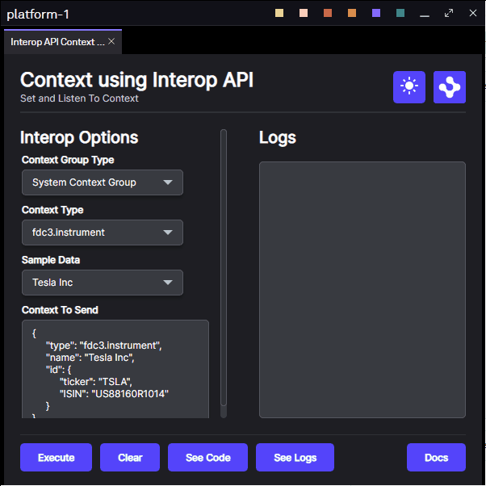
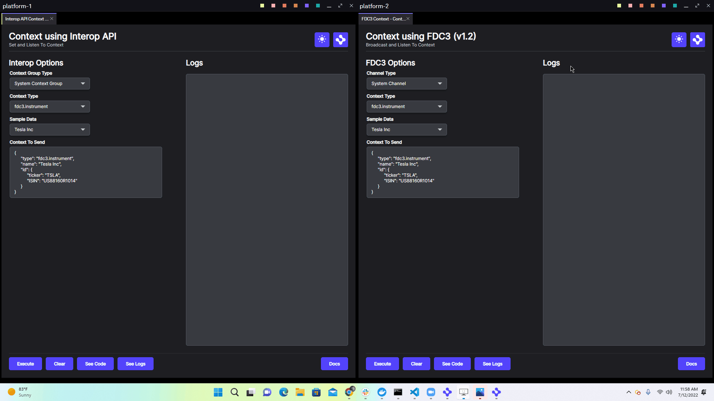

# Use Cross Platform Interop

This repository demonstrates how to use OpenFin's interop overrides to enable context sharing from two different Platform Applications using our [@openfin/cloud-interop](https://www.npmjs.com/package/@openfin/cloud-interop) npm package and our cloud offering.

Before diving in we recommend taking some time familiarize yourself with the concepts and terms found in the [interoperability overview](https://developers.openfin.co/of-docs/docs/interoperability-overview) section of our documentation.

## How it Works

The interop object, made available through OpenFin views and windows, is programmatically accessible through the concept of platform provider overrides. A platform provider override enables a developer to implement additional logic from objects defined on an instance of an OpenFin window or view entity. In this case specifically, we will be focusing on the `interopOverride`. We are creating an interop override by providing configuration to the [@openfin/cloud-interop](https://www.npmjs.com/package/@openfin/cloud-interop) cloudInteropOverride function.

We read cloud interop settings from the custom settings section of [manifest.fin.json](./public/manifest.fin.json) and [second.manifest.fin.json](./public/second.manifest.fin.json). You will need to contact OpenFin to get the required settings for your PoC and then you will need to enable this functionality.

```json
"customSettings": {
    "cloudInteropProvider": {
        "enabled": false,
        "connectParams": {
        "url": "<PLEASE ASK OPENFIN FOR A URL>",
        "userId": "<PLEASE ASK OPENFIN FOR A USER ID>",
        "password": "<PLEASE ASK OPENFIN FOR A PASSWORD>",
        "platformId": "cloud-interop",
        "sourceId": "platform1",
        "sourceDisplayName": "Platform 1"
      }
    }
}
```

We have created a custom window template to host the views so that we can include a context group picker and the platform's title. The logic for this can be found here: [window.ts](./client/src/window.ts) and the html can be found here: [window.html](./public/html/window.html).

The views point to FDC3 and Interop urls that we have created to help developers learn more about interop.

## Get Started

Follow the instructions below to get up and running.

### Set up the project

1. Install dependencies and do the initial build. Note that these examples assume you are in the sub-directory for the example.

```shell
npm run setup
```

2. Build the project.

```shell
npm run build
```

3. Start the test server in a new window.

```shell
npm run start
```

4. Start the first Platform application.

```shell
npm run client
```

5. Start the second Platform application.

```shell
npm run secondclient
```

### Use the project interface

From a single Platform: add two views to the same window's context group, and sharing context between the two views.

1. Add each view to the same context group.
2. Submit a context from the first view.
3. Submit a different context from second view.



From two different Platforms: add a view from a window's context group in platform-1 and a view from a window's context group in platform-2 to a connected context group based on a shared or common context group between each Platform. Once connected we can share context between two different platforms.

1. Add a view from platform-1 the window's context group in platform-1.
2. Add a view from platform-2 to the same context group selected in platform-1.
3. Submit a context from the first view.
4. Submit a different context from second view.

> NOTE: the logic for creating a cloud interop override instance and passing it to the platform [client/src/provider.ts](./client/src/provider.ts)



### A note about this example

This is an example of how to use OpenFin APIs to configure OpenFin Container. Its purpose is to provide an example and suggestions. **DO NOT** assume that it contains production-ready code. Please use this as a guide and provide feedback. Thanks!
