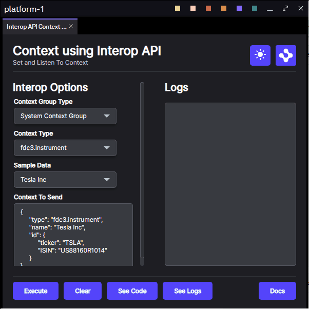
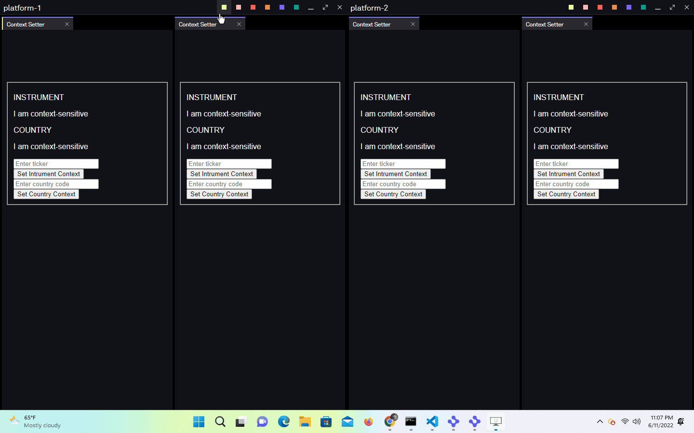

# Use Cross Platform Interop

This repository demonstrates how to use OpenFin's interop overrides to enable context sharing from two different Platform Applications

Before diving in we recommend taking some time familiarize yourself with the concepts and terms found in the [interoperability overview](https://developers.openfin.co/of-docs/docs/interoperability-overview) section of our documentation.

## How it Works

The interop object, made available through OpenFin views and windows, is programmatically accessible through the concept of platform provider overrides. A platform provider override enables a developer to implement additional logic from objects defined on an instance of an OpenFin window or view entity. In this case specifically, we will be focusing on the `interopOverride` implementing additional logic related to the `interop` object on a Platform's window and view entities.

## Get Started

Follow the instructions below to get up and running.

### Set up the project

1. Install dependencies and do the initial build. Note that these examples assume you are in the sub-directory for the example.

```shell
npm run setup
```

2. Build the project.

```shell
npm run build
```

3. Start the test server in a new window.

```shell
npm run start
```

4. Start the first Platform application.

```shell
npm run client
```

5. Start the second Platform application.

```shell
npm run secondclient
```

### Use the project interface

From a single Platform: add two views to the same window's context group, and sharing context between the two views.

1. Add each view to the same context group.
2. Submit a context from the first view.
3. Submit a different context from second view.



From two different Platforms: add a view from a window's context group in platform-1 and a view from a window's context group in platform-2 to a connected context group based on a shared or common context group between each Platform. Once connected we can share context between two different platforms.

1. Add a view from platform-1 the window's context group in platform-1.
2. Add a view from platform-2 to the same context group selected in platform-1.
3. Submit a context from the first view.
4. Submit a different context from second view.

> NOTE: the logic and documentation for how two different platforms are able to share context is provided in `client/src/provider.ts`



### A note about this example

This is an example of how to use OpenFin APIs to configure OpenFin Container. Its purpose is to provide an example and suggestions. **DO NOT** assume that it contains production-ready code. Please use this as a guide and provide feedback. Thanks!
