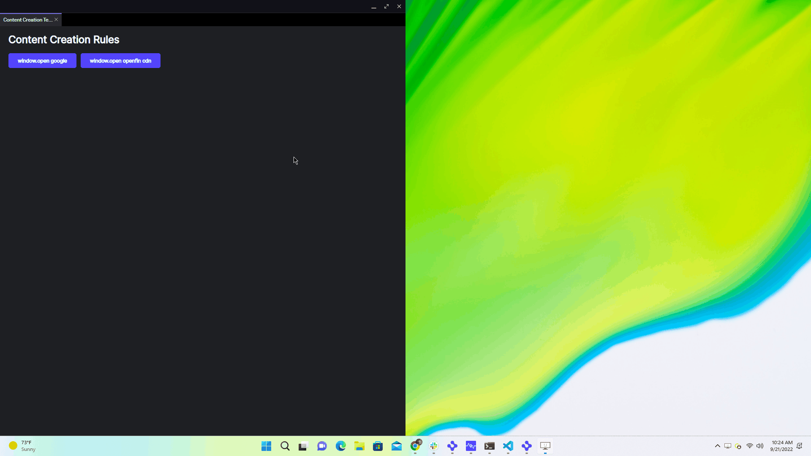

# How to use Content Creation Rules

## How it Works

This example demonstrates how to use [content creation rules](https://developers.openfin.co/of-docs/docs/content-creation-rules) to specify the behavior for new windows created using the web native `window.open` call.

Below is the content creation rule set defined in the [platform manifest](./public/manifest.fin.json) `"platform.defaultViewOptions"` object.

```json
"contentCreation": {
    "rules": [
        {
            "behavior": "view",
            "match": ["*://cdn.openfin.co/*"]
        },
        {
            "behavior": "view",
            "match": ["*://*.google.com/*"]
        }
    ]
}
```

In the `client/src/default-window.ts` the `child-view-created` and `view-child-view-created` events we create the view from the `window.open` call invoked in `client/src/app.ts`.

## Get Started

Follow the instructions below to get up and running.

### Set up the project

1. Install dependencies and do the initial build. Note that these examples assume you are in the sub-directory for the example.

   ```shell
   npm run setup
   ```

2. Build the project.

   ```shell
   npm run build
   ```

3. Start the test server in a new window.

   ```shell
   npm run start
   ```

4. Start the Platform application.

   ```shell
   npm run client
   ```



### A note about this example

This is an example of how to use OpenFin APIs to configure OpenFin Container. Its purpose is to provide an example and suggestions. **DO NOT** assume that it contains production-ready code. Please use this as a guide and provide feedback. Thanks!
