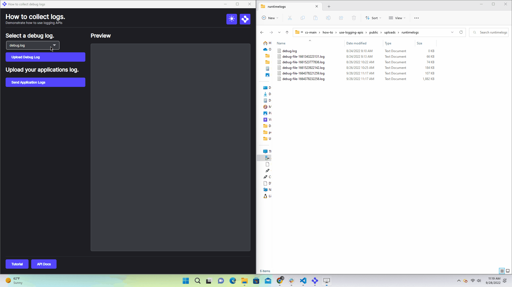

# How to use logging APIs

## How it Works

### Collecting **Runtime Debug Logs**

1. The dropdown seen below is populated by the resolved Promise's name attribute returned by the [getLogList](https://developer.openfin.co/docs/javascript/stable/classes/OpenFin.System.html#getLogList) API.
2. Clicking the button under the debug log list retrieves the correct log by passing in the the name parameter to the [getLog](https://developer.openfin.co/docs/javascript/stable/classes/OpenFin.System.html#getLog) API, and submits an HTTP POST request to `http://localhost:5050/uploads` with the selected the [File](https://developer.mozilla.org/en-US/docs/Web/API/File) Object's contents.
3. [The server](server/src/index.ts) registers an endpoint `/uploads` that handles HTTP post requests via a middleware function that parses and collects the [File](https://developer.mozilla.org/en-US/docs/Web/API/File) Object created with content's, and saves to disk under the path `public/uploads/runtimelogs`.

### Collecting **Application Logs**

1. Enable application logging as seen in this application's [manifest](./public/manifest.fin.json) (this will capture and write console log messages from within the platform and write it to disk)

   ```json
   "enableAppLogging": true,
   "logManagement": {
        "enabled": true,
        "url": "http://localhost:5050"
    }
   ```

2. Add the exact endpoint/path `"/api/v1/logs"` to the server root defined in `logManagement.url`. _Please note_: this is **required** for the RVM to send an HTTP POST request with the Application log contents.
3. [The server](server/src/index.ts) registers a _REQUIRED exact_ endpoint `/api/v1/logs` that handles HTTP post requests via a middleware function that parses and collects the zip file containing the application logs, and saves to disk under the path `public/uploads/applogs`.

### Collecting **OPFS Logs**

An example that uses the [Origin Private File System](https://developer.mozilla.org/en-US/docs/Web/API/File_System_API/Origin_private_file_system) to create a log file that is private to the application but resides on disk. This file is written to via the provider and a log API exposed through the Channel API. The use of the Channel API to capture log messages from views and the provider is just an example (and is not intended for high frequency logging like debug, info). If your content is from the same domain there are other options such as [Shared Web Workers](https://developer.mozilla.org/en-US/docs/Web/API/SharedWorker) or [Broadcast Channels](https://developer.mozilla.org/en-US/docs/Web/API/Broadcast_Channel_API) or a library that uses the OPFS directly from the view/window.

The example writes log messages sent via the Channel API to a simple log.log file against the OPFS. When it is uploaded it reads the contents of the log from the OPFS and posts the content to `"/opfsuploads"`. This is written to `public/uploads/opfslogs` using the node server. The log file within OPFS is then cleared. This is just an example to show the option of OPFS.

## Get Started

Follow the instructions below to get up and running.

## Set up the project

1. Install dependencies and do the initial build. Note that these examples assume you are in the sub-directory for the example.

```shell
npm run setup
```

2. Build the project.

```shell
npm run build
```

3. Start the test server in a new window.

```shell
npm run start
```

4. Start the Platform application.

```shell
npm run client
```


