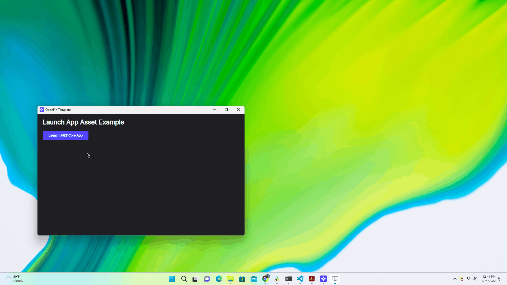

# Use the launch external process API to run an appAsset

This repository demonstrates the use of the `System.launchExternalProcess`, to launch an `appAsset` defined in an Application's manifest. `System.launchExternalProcess` is a [secure API][1] that can be enabled by user acceptance, or [desktop owner settings][2].

[1]: https://developers.openfin.co/of-docs/docs/api-security 'Read more on secure api here'
[2]: https://developers.openfin.co/of-docs/docs/desktop-owner-settings 'Read more on desktop owner settings here'

## Get Started

Follow the instructions below to get up and running.

### Set up the project

1. Install dependencies and do the initial build. Note that these examples assume you are in the sub-directory for the example.

   ```shell
   npm run setup
   ```

2. Build the project.

   ```shell
   npm run build
   ```

3. Start the test server in a new window.

   ```shell
   npm run start
   ```

4. Start the Platform application.

   ```shell
   npm run client
   ```



## App asset breakdown

This is an example shape as it related to the top level application manifest property as seen [here](https://developers.openfin.co/of-docs/docs/application-configuration#section-appassets-properties).

`public/app.json`

```json
 "appAssets": [{
     "src": "http://localhost:5050/assets/openfin-dotnet-example.zip",
     "version": "3.1",
     "alias": "of-dotnet-example",
     "target": "DotNetCore.exe",
     "mandatory": true
 }],
```

### Property definitions

- `"src"`: url to an accessible compressed zip file containing the executable.
- `"version"`: a string to store that corresponds with the directory the application asset is stored under on disk.
- `"alias"`: a string that represents an identifier that can be used to invoke the asset from the application context in which it has been downloaded to.
- `"target"`: relative extracted path to the executable file within the compressed zip.
- `"mandatory"`: in order for the application to start the appAsset must be successfully downloaded.
- APPLICATION-NAME: `"startup_app.name"`
- HASH: HASHED use to differentiate app instances.
- Default directory:

```bash
%LOCALAPPDATA%\OpenFin\[APPLICATION-NAME]_[HASH]\assets\["alias"]\["version"]
```

> **Please Note**: APPLICATION-NAME and HASH are describing a folder name, they are **NOT** environment variables.

### A note about this example

This is an example of how to use OpenFin APIs to configure OpenFin Container. Its purpose is to provide an example and suggestions. **DO NOT** assume that it contains production-ready code. Please use this as a guide and provide feedback. Thanks!
