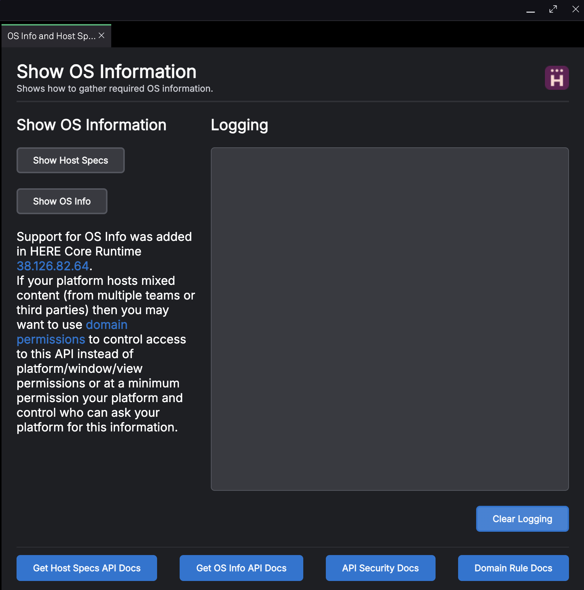

# Get OS Info

## How it Works

This example launches a single window containing an app that uses our **[getHostSpecs API](https://developer.openfin.co/docs/javascript/stable/classes/OpenFin.System.html#getHostSpecs)** API and our **[getOSInfo API](https://developer.openfin.co/docs/javascript/stable/classes/OpenFin.System.html#getOSInfo)**. There are buttons for displaying the Host Specs and OS Info and the API you need to call. Buttons that open up related content is also provided.

## Permissions

The getOSInfo API is behind a permission **[getOSInfo](https://resources.here.io/docs/core/develop/security/api-security)**. For this sample we are using the standard permissions configuration in the manifest to allow this API to be used in the platform and for all views:

```javascript
"platform": {
  "uuid": "how-to-use-os-info",
  "defaultViewOptions": {
   "permissions": {
    "System": {
     "getOSInfo": true
    }
   }
  },
  "permissions": {
   "System": {
    "getOSInfo": true
   }
  }
 }
```

> Note: When it comes to your own platform we recommend you look at using **[domain permissions](https://resources.here.io/docs/core/develop/security/domain-permissions/)** especially if you are including content from other parties within your platform.

## Get Started

Follow the instructions below to get up and running (from this directory).

### Set up the project

1. Install dependencies and do the initial build:

```shell
npm run setup
```

2. Start the test server in a new terminal:

```shell
npm run start
```

3. Launch the platform:

```shell
npm run client
```

### What you will see



### A note about this example

This is an example of how to use HERE APIs to configure HERE Core Container. Its purpose is to provide an example and suggestions. **DO NOT** assume that it contains production-ready code. Please use this as a guide and provide feedback. Thanks!
