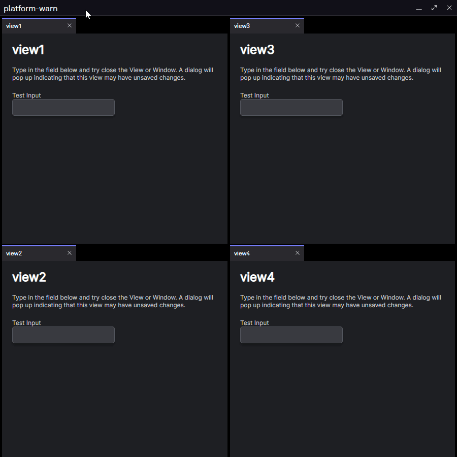

# Implement Warn Before Closing Dialog

This repository demonstrates how to implement your own warning dialog for when Views have set a before unload handler.

Before diving in we recommend taking some time to familiarize yourself with all different [Platform Overrides](https://cdn.openfin.co/docs/javascript/stable/PlatformProvider.html) you can use to better customize this behavior. This demo will only focus on getUserDecisionBeforeUnload, but there are other overrides you can use to fine tune what you need.

## Get Started

Follow the instructions below to get up and running.

### Set up the project

1. Install dependencies. Note that these examples assume you are in the sub-directory for the example.

```shell
npm install
```

2. Build the project.

```shell
npm run build
```

3. Start the test server in a new window.

```shell
npm run server
```

4. Start the Platform application.

```shell
npm run platform
```

### Use the project interface

You will see 4 Views. Each View has an input field. Whenever you type in one of these fields a before unload handler is set on its View. If you try to close the View or the Window you will see a dialog warning you of any potential unsaved changes.



> NOTE: the logic and documentation is provided in `client/src/provider.ts`

### A note about this example

This is an example of how to use OpenFin APIs to configure OpenFin Container. Its purpose is to provide an example and suggestions. **DO NOT** assume that it contains production-ready code. Please use this as a guide and provide feedback. Thanks!