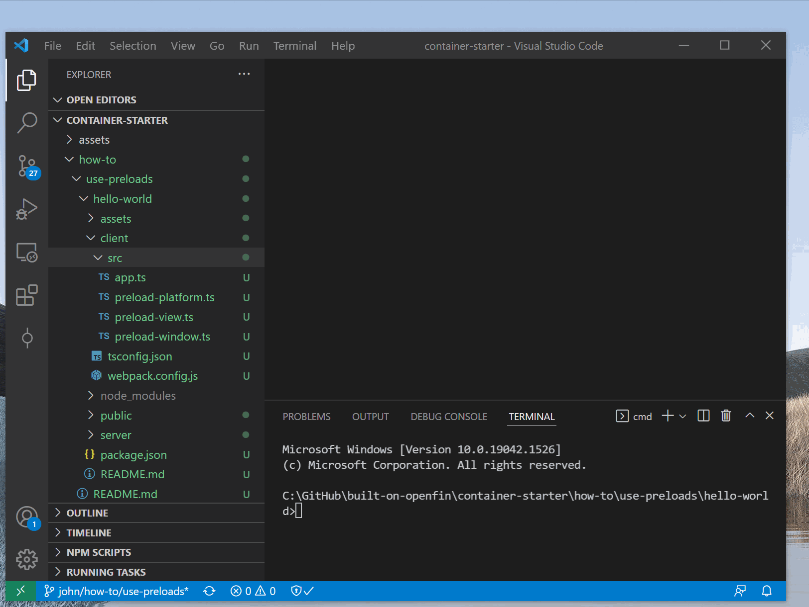
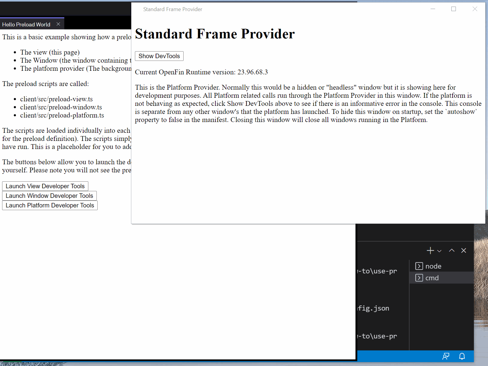

# Use Preloads Hello World

This repository demonstrates how to use OpenFin Runtime Preload capabilities to inject a script into the different parts of an OpenFin application.

Preload scripts can be defined in window and view options or as part of a manifest.

The manifest in [public/manifest.fin.json](public/manifest.fin.json) shows how you can add a preload script to your platform provider, to all windows or to all views (using the default options setting).

## How it Works

The preload script is injected into the page you are targeting. The sample checks to see if the page has finished loading (if it has it executes a function that simply logs out a message) and if hasn't then it adds an event listener in order to only execute some logic when the page is ready. The buttons on the view execute logic to show developer tools for each part of the OpenFin application that had preload scripts loaded.

## Get Started

Follow the instructions below to get up and running.

### Set up the project

1. Install dependencies. Note that these examples assume you are in the sub-directory for the example.

```shell
npm install
```

2. Build the project.

```shell
npm run build
```

3. Start the test server in a new window.

```shell
npm run start
```

4. Start the Platform application.

```shell
npm run client
```



### What you will see

1. The default platform provider window (as the manifest sets autoshow to true to help with development)

2. A platform window using the default template

3. A view presenting some descriptive text and three buttons in order to show the developer tools for the platform provider, the default platform window and the view (to show that the individual preload scripts have loaded and console logged their message).



### A note about this example

This is an example of how to use OpenFin APIs to configure OpenFin Container. Its purpose is to provide an example and suggestions. **DO NOT** assume that it contains production-ready code. Please use this as a guide and provide feedback. Thanks!
