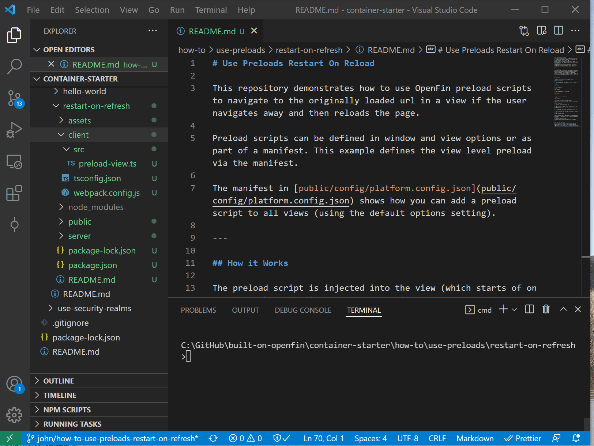
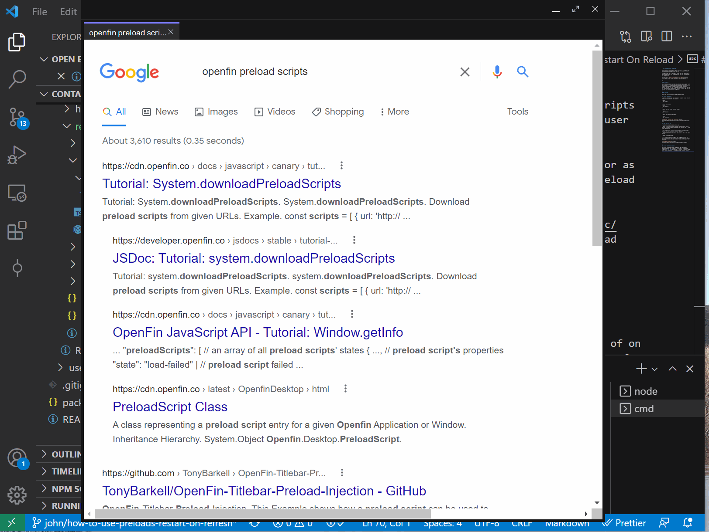

# Use Preloads Restart On Refresh

This repository demonstrates how to use HERE preload scripts to navigate to the originally loaded url in a view if the user navigates away and then reloads/refreshes the page.

Preload scripts can be defined in window and view options or as part of a manifest. This example defines the view level preload via the manifest.

The manifest in [public/manifest.fin.json](public/manifest.fin.json) shows how you can add a preload script to all views (using the default options setting).

## How it Works

The preload script is injected into the view (which starts of on google.com). Reloading the view at this stage does nothing. If you navigate to a different page and reload the page (you can use right-click reload or location.reload() via the developer console) then you will end up back at the original url. If you use the console settings in developer tools to preserve logs then you will see all the interactions logged out.

## Get Started

Follow the instructions below to get up and running.

### Set up the project

1. Install dependencies and do the initial build. Note that these examples assume you are in the sub-directory for the example.

```shell
npm run setup
```

2. Build the project.

```shell
npm run build
```

3. Start the test server in a new window.

```shell
npm run start
```

4. Start the Platform application.

```shell
npm run client
```



### What you will see

1. A platform window loading google.com

2. Right click and reload and open the developer tools to see that the preload script has loaded and has detected that a reload of the page occurred.

3. In the developer tools if you select preserve log then you will see the interactions of the next few steps.

4. With the developer tools still open click on one of the search results.

5. Right click and reload.

6. The view should have navigated back to google.com and the console should show that it detected that a reload event happened and it wasn't on the initial url which is why it navigated back to google.



### A note about this example

This is an example of how to use HERE APIs to configure HERE Core Container. Its purpose is to provide an example and suggestions. **DO NOT** assume that it contains production-ready code. Please use this as a guide and provide feedback. Thanks!
