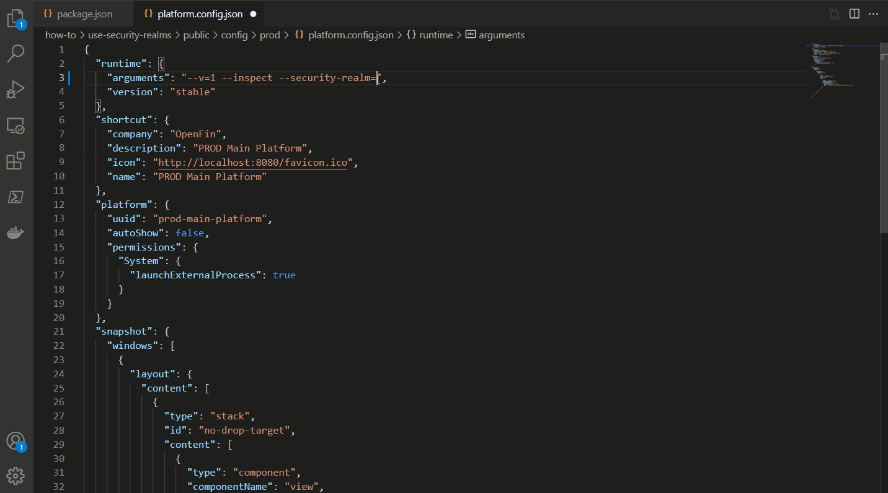
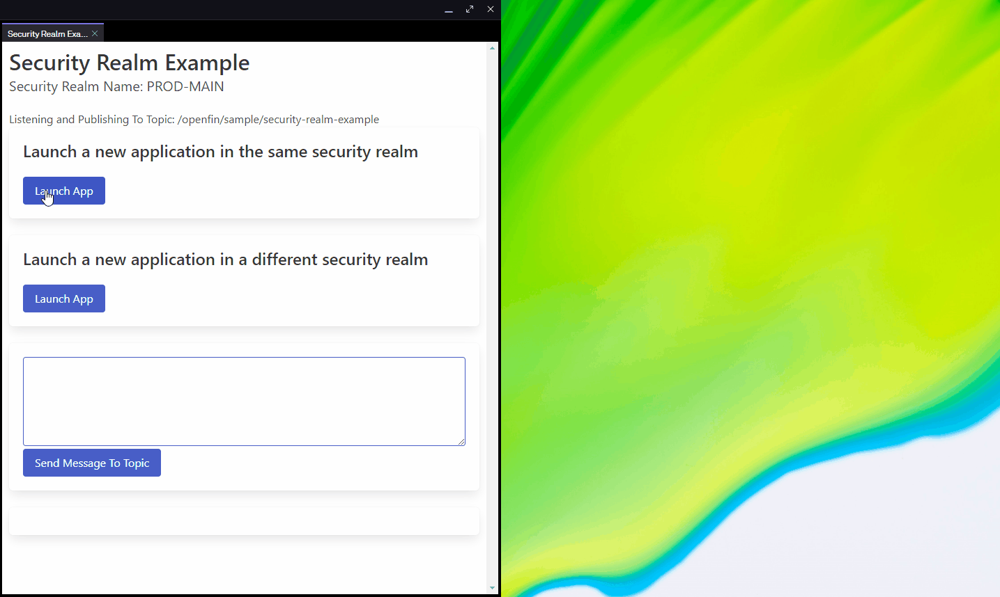
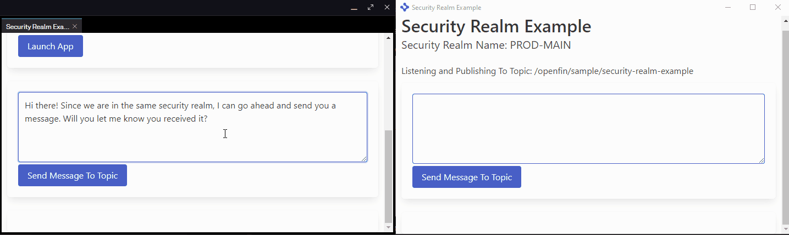
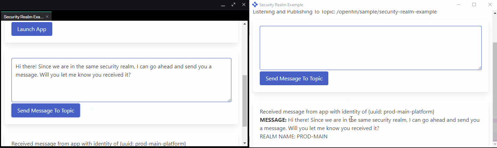
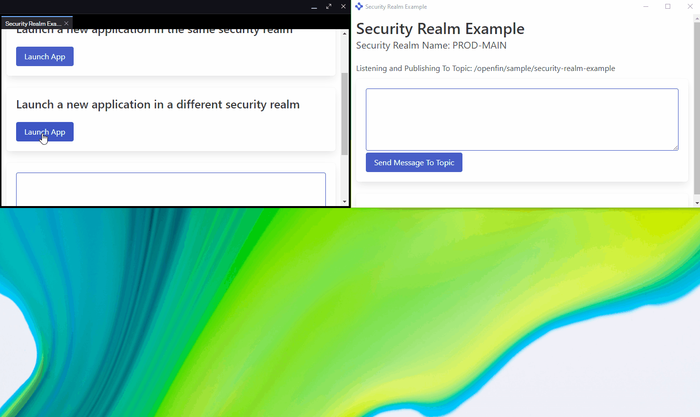
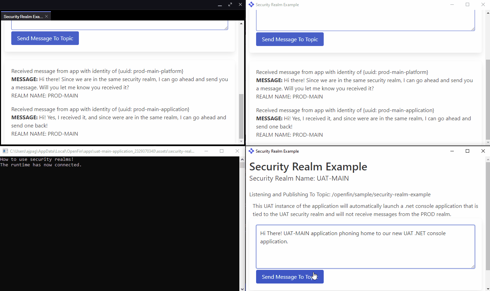

# Use security realms

This repository demonstrates how to use OpenFin Runtime security realms to isolate application that have different target environments and enable interoperability between applications sharing the same target environment.

Before diving in we recommend taking some time reading an [overview of how security realms work](https://developers.openfin.co/of-docs/docs/openfin-security#security-realms).

## How it Works

Security realms can be enabled by specifying the `--security-realm` argument in an application's manifest. The value is the name of the security realm.



## Get Started

Follow the instructions below to get up and running.

### Set up the project

1. Install dependencies and do the initial build. Note that these examples assume you are in the sub-directory for the example.

```shell
npm run setup
```

2. Build the project.

```shell
npm run build
```

3. Start the test server in a new window.

```shell
npm run start
```

4. Start the Platform application.

```shell
npm run client
```

### Use the project interface

1. Launch the PROD manifest (`http://localhost:5050/manifest.fin.json`). An OpenFin Platform window opens, containing a single view with the following features:

   - A button to launch an application in **the same** target environment and security realm
   - A button to launch an application in **a different** target environment and security realm
   - A text area to enter a message.

2. Click **Launch App** in the first box, to demonstrate the behavior of applications communicating normally in the same security realm. A new application starts, as shown in the following image.
   

3. From the Platform window, you can send a message to the launched application within the same security realm as the initially launched application. Type something into the text area and press **Send Message To Topic**.
   

   Success! The message appears in the application, because it is in the same security realm and is running on the same runtime version as the Platform view it was launched from. In the application, you can send a message back to the Platform view for acknowledgement.
   

4. Now launch the application using the **Launch App** button in the second box.
   

   This application represents a UAT environment and is launched from `http://localhost:5050/uat/manifest.fin.json`. It is configured with a _different_ security realm name than the first application you launched, whose manifest is from `http://localhost:5050/manifest.fin.json`. As an example, suppose you are testing a new native feature, so there is an `appAsset` value in the manifest that is only available in the UAT environment.

5. Type a message into the UAT application and press **Send Message To Topic**. Although the content from both applications consists of the same HTML and JavaScript, each application is restricted to the context of its security realm, because they have different security realms defined. Therefore, the message does not go to the Platform view, but to a console window.
   

## File and folder structure

_The paths provided in this description are relative to the server host_: `http://localhost:5050`

- Target Environments
  - PROD
    - Platform Manifest: `/manifest.fin.json`
      - Security Realm: `"PROD-MAIN"`
      - Contains a platform view loaded from: `/html/view-app.html`
        - Contains TypeScript written in `client/src` and loaded from: `../js/view-app.bundle.js`
    - Application Manifest: `/app.fin.json`
      - Security Realm: `"PROD-MAIN"`
      - Contains an window loaded from: `/html/app.html`
        - Contains TypeScript written in `client/src` and loaded from: `../js/app.bundle.js`
  - UAT
    - Platform Manifest: `/uat/manifest.fin.json`
      - Security Realm: `"UAT-MAIN"`
      - Contains a platform view loaded from: `/html/view-app.html`
        - Contains TypeScript written in `client/src` and loaded from: `../js/view-app.bundle.js`
    - Application Manifest: `/uat/app.fin.json`
      - Security Realm: `"UAT-MAIN"`
      - Contains a platform view loaded from: `/html/app.html`
        - Contains TypeScript written in `client/src` and loaded from: `../js/view-app.bundle.js`
      - Contains an `appAsset` with a .NET adapter console application that subscribes to messages coming from applications in the `UAT-MAIN` security realm.

### A note about this example

This is an example of how to use OpenFin APIs to configure OpenFin Container. Its purpose is to provide an example and suggestions. **DO NOT** assume that it contains production-ready code. Please use this as a guide and provide feedback. Thanks!
