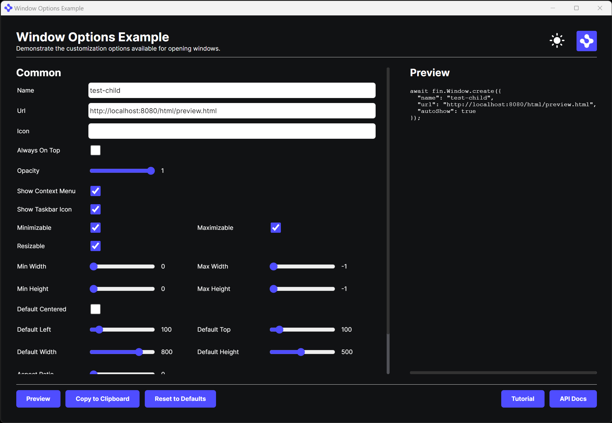
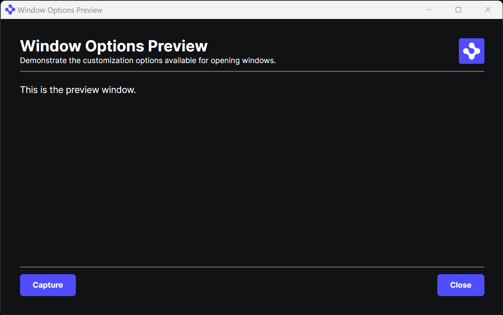
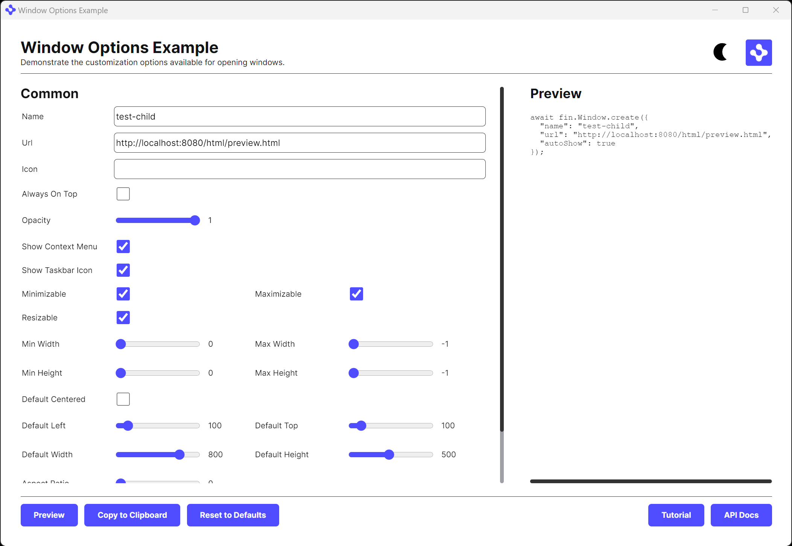
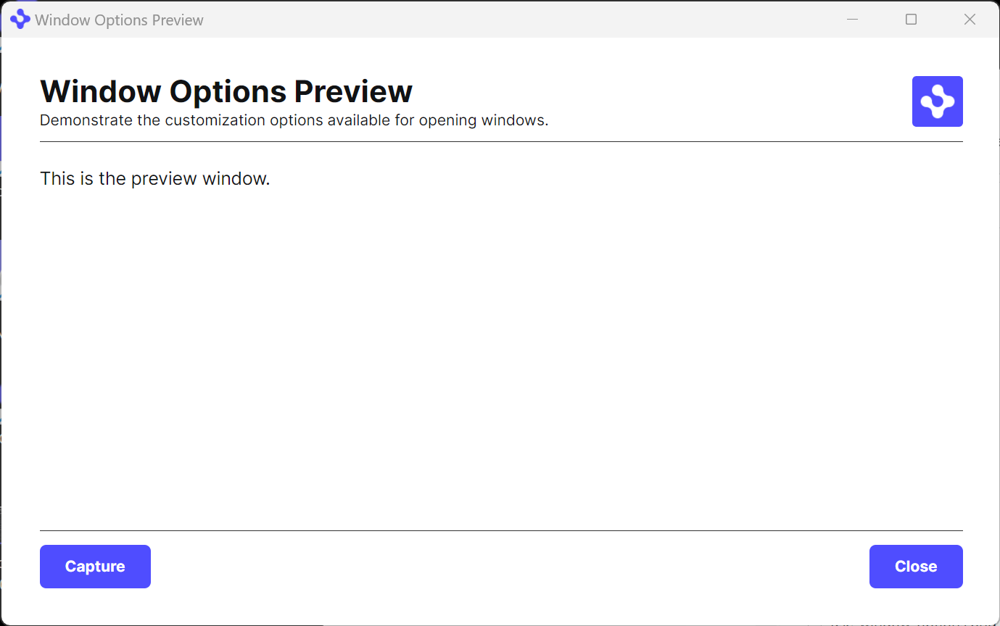

# Demonstrate the different options available for showing windows

## How it Works

The app.ts listens processes the options specified in the main screen and applies them when launching a dynamic window.

## Get Started

Follow the instructions below to get up and running.

### Set up the project

1. Install dependencies and do the initial build. Note that these examples assume you are in the sub-directory for the example.

```shell
npm run setup
```

2. Build the project.

```shell
npm run build
```

3. Start the test server in a new window.

```shell
npm run start
```

4. Start the Platform application.

```shell
npm run client
```

### What you will see

1. App showing the options you can choose when displaying HERE windows.



2. Preview



Alternate light mode views.



2. Preview



### A note about this example

This is an example of how to use HERE APIs to configure HERE Core Container. Its purpose is to provide an example and suggestions. **DO NOT** assume that it contains production-ready code. Please use this as a guide and provide feedback. Thanks!
